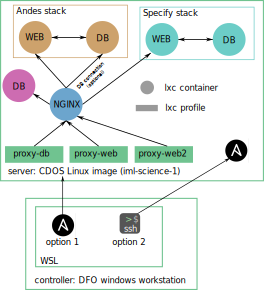
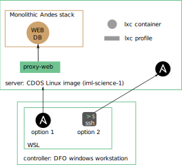

# Main System architecture

The Andes stack is completely containerized.
The services are broken up into three LXC containers:
 - database server: `andes-db`
 - webserver: `andes-web`
 - reverse proxy: `gninx-proxy`
The containers all run on the same server hardware running a CDOS manage Linux image.

The architecture is show in the system diagram below.

The lxc containers are shown are circles and lxc profiles (attached to the containers) are shown as rectangles.
Ansible creates and manages the containers and profiles.
The Ansible playbooks can either be executed from a controller (option 1) or directly from the server (options 2).
Note that to execute the ansible playbooks from the server, ansible must first be installed. No elavate priviledges are needed (can sible can sit in in user-land).
Both case require an SSH connection between the server and the controller: ansible uses it's own SSH connection for option 1; or an interactive user-session for option 2.

The diagram shows that other services may exist on the server, (e.g., another web app stack (called Specify) or some other database server).
These are shown as lxc containers as well, but are not managed by the Ansible scripts containes in this repository.

The diagram shows that the `nginx-proxy` container manages all connections to the different hosted services. This configuration will have to be manually realized, as the setup contained herin only manages traffic for andes.

Alternatively, the nginx container (dedicated to andes) can be bypassed by pointing the lxc proxies straight to the containers offering the other services ( extra DB and the Specify stack).

## Note on database connections
It is possible (and more secure) to limit all database connections to the `andes-db` container to ones originating from the `andes-web` container. 
Thus limiting all activity to only web-app queries.
External connections are allowed however for debugging and development purposes.
This access can be eliminated by i) reconfiguration of the reverse proxy and/or ii) changing the "host" of the MySQL database user.

# Post-prod system architechture
A post-prod instance (dedicated to a single mission) can be setup using the mission backup/fixture.

For this we use the monolithic system architcutre where the DB and WEB server are part of the same lxc container.

